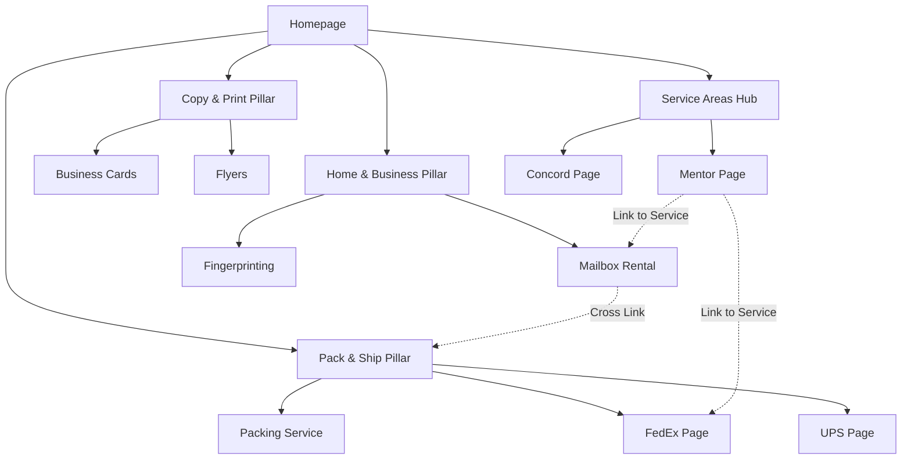

# Mailbox Plus Internal Linking Strategy & SEO Site Structure

This document outlines the hierarchical structure, internal linking rules, and specific link maps designed to maximize SEO performance for **mailboxplusohio.com**. The strategy focuses on establishing topical authority for key services while reinforcing local relevance for Concord Township, Mentor, Painesville, and surrounding Lake County areas.

## 1. Hierarchical SEO Sitemap

This structure organizes content from broad topics (Pillars) to specific intents (Supporting Pages).

### **Level 1: Homepage**

- `https://mailboxplusohio.com/`

### **Level 2: Pillar Pages (Category Hubs)**

These pages aggregate all related services and pass authority down to specific service pages.

1.  **Pack & Ship:** `/pack-ship`
2.  **Copy & Print:** `/copy-print`
3.  **Home & Business:** `/home-business` (Includes Mailbox Rentals & Document Services)
4.  **Service Areas:** `/service-area` (Local SEO Hub)

### **Level 3: Supporting Service Pages (The Content)**

These are the primary ranking targets for specific service keywords.

**Pack & Ship Cluster (`/pack-ship/...`)**

- `.../fedex-shipping` (FedEx)
- `.../ups-authorized-shipper-outlet` (UPS)
- `.../usps-services` (USPS)
- `.../dhl-express` (DHL)
- `.../package-drop-offs` (Drop-offs)
- `.../professional-packing` (Packing Service)
- `.../custom-box-making` (Custom Boxes)
- `.../packaging-supplies` (Supplies)
- `.../artwork-shipping` (Niche)
- `.../bicycle-shipping` (Niche)
- `.../golf-club-shipping` (Niche)
- `.../postage-stamps` (Product)
- `.../package-receiving` (Service)

**Copy & Print Cluster (`/copy-print/...`)**

- `.../document-printing` (General)
- `.../business-cards` (Product)
- `.../flyers-brochures` (Product)
- `.../posters-printing` (Wide Format)
- `.../postcard-printing` (Product)
- `.../graphic-design` (Service)
- `.../copies` (Service)

**Home & Business Cluster (`/home-business/...`)**

- `.../mailbox-rental` (Core Service)
- `.../digital-mailbox-rental` (Virtual)
- `.../shredding` (Security)
- `.../document-scanning` (Digital)
- `.../fax-services` (Legacy)
- `.../every-door-direct-mail` (Marketing)

**Specialty Cluster (`/specialty/...`)**

- `.../digital-fingerprinting`
- `.../insurance`

**Sub-Supporting Content (Guides & Tools)**

- `/amazon-returns` (Guide)
- `/fedex-easy-returns` (Guide)

### **Level 4: Local Landing Pages (`/service-area/...`)**

These pages capture location-specific intent (e.g., "shipping near Mentor").

- `.../concord-township` (Home Base)
- `.../mentor`
- `.../painesville`
- `.../willoughby`
- `.../wickliffe`
- `.../eastlake`
- `.../madison`
- `.../perry`
- `.../kirtland`
- `.../chardon`
- `.../fairport-harbor`
- `.../geneva`

---

## 2. Internal Linking Rules

To maintain a clean flow of "link juice" and user navigation, follow these strict rules:

### **A. Pillar-to-Service (Top-Down)**

- **Rule:** Every Pillar Page must link to **ALL** its child Service Pages.
- **Location:** Grid or List layout on the Pillar Page.
- **Anchor Text:** The exact service name (e.g., "FedEx Shipping", "Business Cards").

### **B. Service-to-Pillar (Reverse)**

- **Rule:** Every Service Page must link back to its parent Pillar Page.
- **Location:**
  1.  **Breadcrumbs:** `Home > Pack & Ship > FedEx Shipping`
  2.  **In-Content:** First paragraph mentions the broader category.
- **Anchor Text:** "Pack & Ship services", "Copy & Print center".

### **C. Cross-Linking (Contextual)**

- **Rule:** Link related services where they naturally fit in the user journey.
- **Common Patterns:**
  - **Shipping Pages** $\to$ Link to _Packaging Supplies_ and _Shipping Insurance_.
  - **Mailbox Pages** $\to$ Link to _Package Receiving_ and _Digital Mailbox_.
  - **Printing Pages** $\to$ Link to _Graphic Design_.
  - **Return Guides** $\to$ Link to _Package Drop-offs_.

### **D. Local-to-Service (The "Bridge")**

- **Rule:** Local Pages must link to the specific services mentioned in their copy.
- **Strategy:** "Residents of **Mentor** rely on us for **secure mailbox rentals** and **FedEx shipping**."
  - _secure mailbox rentals_ $\to$ `/home-business/mailbox-rental`
  - _FedEx shipping_ $\to$ `/pack-ship/fedex-shipping`

### **E. Footer Links**

- **Rule:** Only link Level 2 Pillar Pages and High-Priority Level 3 Pages (Mailbox Rentals, Fingerprinting). Do not clutter the footer with every single service.

---

## 3. Page-to-Page Link Map

This map defines specific link targets and anchor text variations for high-priority pages.

### **Priority Page: Mailbox Rentals** (`/home-business/mailbox-rental`)

| Source Page             | Link Location        | Anchor Text Recommendation                                 |
| :---------------------- | :------------------- | :--------------------------------------------------------- |
| **Homepage**            | Hero/Services Grid   | "Private Mailbox Rentals", "Rent a Mailbox"                |
| **Digital Mailbox**     | "Comparison" Section | "physical mailbox rental", "street address mailbox"        |
| **Package Receiving**   | "Services" Section   | "secure mailbox with 24/7 access"                          |
| **Service Areas (All)** | Body Copy            | "mailbox rental in [City Name]", "secure business address" |

### **Priority Page: FedEx Shipping** (`/pack-ship/fedex-shipping`)

| Source Page             | Link Location       | Anchor Text Recommendation                                |
| :---------------------- | :------------------ | :-------------------------------------------------------- |
| **Homepage**            | Services Grid       | "Authorized FedEx ShipCenter"                             |
| **Package Drop-offs**   | "Accepted Carriers" | "FedEx drop-off", "FedEx shipping services"               |
| **Amazon Returns**      | "Return Options"    | "ship via FedEx", "FedEx label printing"                  |
| **Service Areas (All)** | Body Copy           | "FedEx shipping near [City]", "FedEx authorized location" |

### **Priority Page: Digital Fingerprinting** (`/specialty/digital-fingerprinting`)

| Source Page             | Link Location       | Anchor Text Recommendation                                  |
| :---------------------- | :------------------ | :---------------------------------------------------------- |
| **Homepage**            | Featured Services   | "Digital Fingerprinting", "Background Checks"               |
| **Notary Services**     | "Identity Services" | "background checks", "digital fingerprinting services"      |
| **Service Areas (All)** | Body Copy           | "fingerprinting in [City]", "BCI and FBI background checks" |

### **Priority Page: Business Cards** (`/copy-print/business-cards`)

| Source Page             | Link Location       | Anchor Text Recommendation                                   |
| :---------------------- | :------------------ | :----------------------------------------------------------- |
| **Graphic Design**      | "What We Design"    | "custom business cards", "professional business card design" |
| **Document Printing**   | "Business Services" | "business cards"                                             |
| **Service Areas (All)** | Body Copy           | "business card printing near [City]"                         |

---

## 4. Recommended Anchor Text Strategy

Avoid generic anchors like "Click Here". Use the following mix:

1.  **Exact Match (50%):** The exact service name.
    - _Example:_ "We offer **FedEx Shipping**..."
2.  **LSI/Semantic (30%):** Variations and related terms.
    - _Example:_ "Our **overnight shipping services** ensure..."
    - _Example:_ "Get a **private street address** with our..."
3.  **Geo-Modified (20%):** Service + Location (Best for incoming links from Local Pages).
    - _Example:_ "**Notary services in Concord Township**"

## 5. Link Maintenance & Auditing Plan

### **Monthly Audit Checklist**

1.  **Broken Link Check:** Use tools (like Ahrefs, SEMrush, or free online checkers) to identify 404 errors.
    - _Action:_ Update link or set up 301 redirect if page moved.
2.  **Orphan Page Check:** Ensure every new page has at least one internal link pointing TO it.
    - _Action:_ Add a link from the relevant Pillar Page.
3.  **Anchor Text Review:** Check that you aren't over-optimizing with the exact same anchor text 100 times.
    - _Action:_ Vary anchor text on new blog posts or local pages.

### **Scalability: Adding New Services**

When adding a new service (e.g., "Wide Format Scanning"):

1.  **Create Page:** `/copy-print/wide-format-scanning`
2.  **Update Pillar:** Add to `/copy-print` grid immediately.
3.  **Update Cross-Links:** Add link from _Document Scanning_ page ("We also offer **wide format scanning**...").
4.  **Update Local Pages:** Add a sentence to key Service Area pages ("Now offering **blueprint scanning** for [City] contractors.").

## 6. Visual Diagrams

### Site Structure Hierarchy

